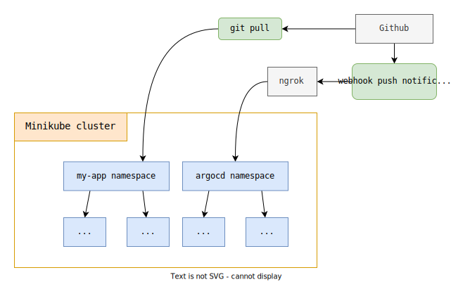

# ArgoCD + Minikube + Ngrok + Github Webhook

Testing **Argo CD** with **Minikube**. Instantaneous update with **Github webhook** and **Ngrok**.

# This repo was created to set up a local infra to test argo ci/ci and kubernetes
